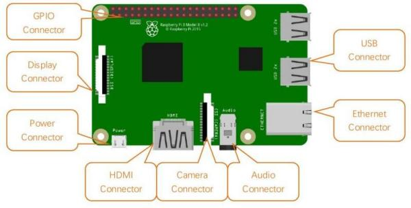

===========================
Introduzione a Raspberry PI
===========================

Raspberry Pi (da ora in poi mi riferirò ad esso chiamandolo semplicemente *Raspberry*, oppure con la sigla RPI) è un microcomputer 
delle dimensioni di una carta di credito.
Progettato dalla *Raspberry PI Foundation*, la sua prima release è avvenuta nel 2012 e rappresenta uno dei migliori esempi di applicazione 
dei modelli di business promossi da `Hardware libero <https://it.wikipedia.org/wiki/Hardware_libero>`_ 
e `Software libero <https://it.wikipedia.org/wiki/Software_libero>`_ insieme. 

.. tip::
    Il suo sito ufficiale è https://www.raspberrypi.org/ in cui è possibile trovare una miriade di informazioni, documentazione, progetti, tutorial e 
    perfino acquistare e farsi spedire un kit per gli esperimenti completo di RPI e di tutto ciò che serve!

Viene ampiamente utilizzato per l'implementazione di migliaia di progetti che includono workstation desktop a basso costo, media center, smart home, 
robot, server `tascabili`, sensoristica, prototyping, ecc. 

Può eseguire un sistema operativo libero, basato su Linux o anche una versione specifica di Windows 10, chiamata `Windows 10 IoT <https://developer.microsoft.com/en-us/windows/iot>`_.

Contiene diverse interfacce hardware di utilizzo comune:

* USB.

* ethernet (rete cablata).

* HDMI.

* fotocamera.

* audio (jack da 3.5mm, quello delle cuffie).

* display

* GPIO (un'interfaccia generica a cui collegare qualsiasi sensore).

* Wifi e Bluetooth onboard

Finora, Raspberry Pi si è sviluppato fino alla quarta generazione. Le modifiche nelle versioni sono accompagnate da aumenti e aggiornamenti dell'hardware. 
Fortunatamente dalla versione 2 in avanti le interfacce e la GPIO si sono uniformati, in modo che qualsiasi progetto possa essere eseguito più o meno allo
stesso modo in qualunque delle ultime versioni.

A scuola abbiamo una serie di `RPI versione 3, modello B+`, modello a cui si riferisce la figura precedente.
La nostra trattazione da qui in avanti si rivolgerà esplicitamente a questo tipo di RPI.
Sappiate comunque che con modifiche minime (e spesso nessuna) quello che vediamo può essere replicato in molte altre versioni di RPI.

