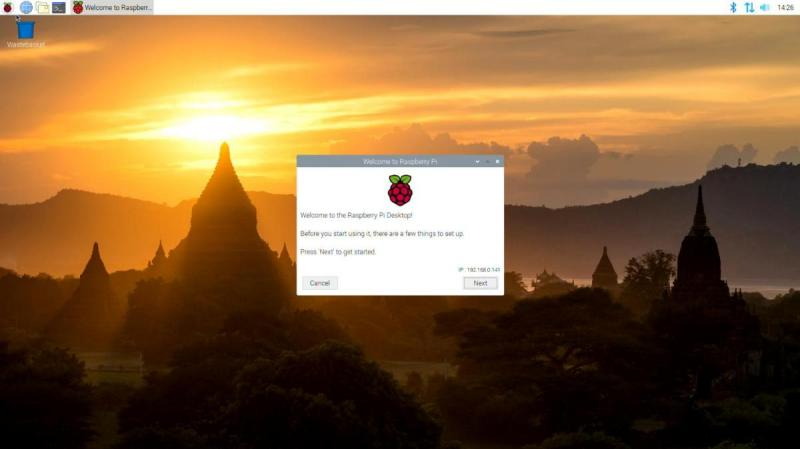
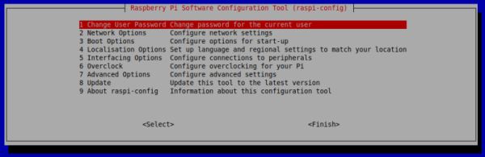
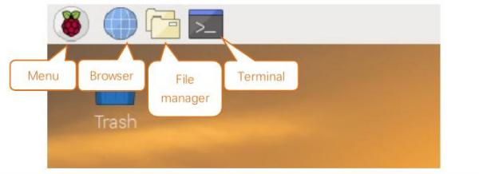

==================
Operazioni di base
==================

Ripartiamo dal Raspberry come lo abbiamo lasciato un attimo fa: acceso, pronto (caricamento iniziale finito), con interfaccia grafica

Ricordo inoltre le credenziali dell'account di default.
    
| **USER: pi**
| **PASS: raspberry**

Il tool che ci viene presentato davanti serve per la configurazione iniziale. Mi raccomando di **non** cambiare la password dell'utente *pi* a meno
che non siate assolutamente sicuri di ricordarvela. In caso siate senza interfaccia grafica, oppure vogliate procedere con la buona vecchia riga di comando, chiudete quella finestra e leggetevi il prossimo capitolo.

Configurazione Raspberry
========================

Il sistema operativo Rasbian fornisce un tool a linea di testo da cui accedere a tutte le configurazioni di base del Raspberry. Per accedere 
ad esso si dovrà utilizzare il comando sudo. 

.. code-block:: bash

    $ sudo raspi-config

A quel punto si avrà accesso ad una interfaccia *grafica-testuale* con cui completare la configurazione:

Le opzioni sono in ordine e si può procedere tramite esse a configurare il Raspberry. Alcune opzioni sono chiarissime e non necessitano di spiegazioni;
ad esempio quella di cambiare password :)

Mi dedico a quelle che di solito servono: 

Network Options
    Le opzioni che trovate qui servono per impostare la rete. Sono cose che potete fare tranquillamente anche tramite l'interfaccia grafica,
    se la utilizzate.
    
    L'opzione importante da settare all'inizio riguarda però l'hostname, il nome del vostro Raspberry! Tramite quello sarà più facile identificarlo
    nella rete! Per applicare questa impostazione serve di riavviare il Raspberry. Potete farlo anche alla fine di tutta la configurazione ;)
    
Localisation Options
    Queste opzioni servono per la localizzazione: tastiera italiana, lingua dei programmi, data, ora e loro formati, WiFi country code, etc... 
    Sono molto importanti da impostare all'inizio in modo da non aver più problemi successivamente. Passate ognuna delle impostazioni alla ricerca 
    delle opzioni italiane; per quanto riguarda il *locale* scegliete l'opzione **it_IT.UTF-8**.
    
Interfacing Options
    In questo menù ci sono le opzioni per attivare o disattivare alcune periferiche o alcuni strumenti software per l'interazione con il Raspberry.
    Tra queste opzioni di interfaccia troviamo la camera, i bus I2C, 1-wire e SPI, la seriale, la remote GPIO, i software SSH e VNC. Attivate o disattivate
    ciò che vi serve (se non sapete che vi serve... disattivatelo). Per applicare le opzioni serve il riavvio.
    
Advanced Options
    Qui ci sono impostazioni abbastanza complicate, studiare... per credere!

Terminate le impostazioni è importantissimo **procedere ad un riavvio** per essere sicuro di aver applicato tutte le modifiche necessarie!

Prime operazioni
================

Riavviato il sistema operativo, diamo un occhio più da vicino al desktop del Raspberry

Poiché considero siate utenti di fascia medio-alta davanti ad un Sistema Operativo, immagino non abbiate problemi ad individuare le applicazioni più
comuni che di certo utilizzeremo su Raspberry.

Le elenco:

* **Browser** (*Chromium*, la versione opensource di Google Chrome)

* **File manager** (*PCManFM*, un software per navigare tra i file del Raspberry)

* **Terminale** (*Terminal*, per accedere alla riga di comando)

* **Text Editor grafico** (*Mousepad*, un programma tipo il *Blocco Note* di Windows)

* **Text Editor testuale** (nel terminale: *nano*)

* **Editor Python** (*IDLE*, oppure *Thonny*... Facile!)

Considero inoltre che siate in grado di muovermi nel menù principale alla ricerca di una applicazione e sappiate interagire con la *system tray* per operazioni
tipo controllare l'ora, abilitare/disabilitare bluetooth o wifi, montare e smontare una penna USB, etc...

Se volete prendere confidenza con queste operazioni, questo è il momento di farlo, **prima** di andare avanti e inesorabilmente iniziare a fingere
di aver capito...

.. note:: 
    Fra le tante cose *nuove* su cui documentarsi, vale secondo me la pena di spendere 5 minuti e curiosare su Internet a proposito della 
    **organizzazione del file system su linux**.
    
    Provate a cercare quella frase in rete e a leggere qualcosa a proposito.
    
    5 minuti, dai...

Il terminale Linux
==================

Adesso vogliamo dedicare un pò di tempo a prendere confidenza con il terminale Linux. Utilizzare l'interfaccia testuale può essere molto vantaggioso in diversi
casi:

* Tutti i sistemi Linux hanno la stessa interfaccia testuale, ma le interfacce grafiche sono potenzialmente tutte diverse

* La connessione remota ad un dispositivo in modalità testuale è veloce, sicura e facile da stabilire

* L'interfaccia testuale è molto potente. Pensate all'interfaccia grafica del vostro Sistema Operativo preferito:
    
    * Come si fa a controllare l'IP della macchina?
    
    * Come si fa a cercare un file all'interno di tutto il computer?
    
    * Come si fa a disintallare un programma? Arrestare un servizio? 
    
Tutte queste operazioni costano un unico comando, una riga di codice con l'interfaccia testuale. E richiedono un secondo o poco più per l'esecuzione.

Adesso che ho attirato la vostra attenzione sull'utilizzo della linea di testo, vediamo alcuni semplici comandi organizzati per utilizzo:

Muoversi fra i file
    =======  ============================================
    Comando  Descrizione
    =======  ============================================
    ls       Elenca i file nella directory corrente (list)
    cd       Cambia Directory.
    pwd      Directory corrente
    =======  ============================================

    
Manipolazione del testo    
    =======  ============================================
    Comando  Descrizione
    =======  ============================================
    cat      Concatena i file e ne manda il contenuto nello standard output
    less     Visualizza il contenuto di un file
    nano     Editor testuale
    =======  ============================================

Gestione di file e directory
    =======  ============================================
    Comando  Descrizione
    =======  ============================================
    mkdir    Crea una directory, una cartella
    touch    Crea un file 
    cp       Copia un file o una directory
    mv       Sposta un file o una directory
    rm       Rimuove un file o una directory
    =======  ============================================

    
Sistema
    ========  ============================================
    Comando   Descrizione
    ========  ============================================
    shutdown  Inizia la procedura di spegnimento
    reboot    Riavvia il sistema
    ========  ============================================

Utilities
    =======  ============================================
    Comando  Descrizione
    =======  ============================================
    history  Elenca la cronologia dei comandi digitati
    man      Apre il manuale richiesto
    =======  ============================================

    
.. note::
    Il comando **sudo** permette di eseguire qualsiasi comando con privilegi amministrativi.
    
    Basta precedere *sudo* a qualsiasi comando per fare come se fosse l'amministratore del sistema
    ad eseguirlo.
    
    .. image:: images/sudo.png
        :align: center
        :alt: sudo examples

    
Gestione software
=================

L' **Advanced Packaging Tool** (conosciuto con l'acronimo APT) è il gestore standard di pacchetti software della distribuzione Debian e di tutte le sue derivate. 
In particolare vale la pena di ricordare Ubuntu e Raspberry come derivate di punta.

Questo sistema di gestione dei pacchetti è in grado di cercare, scaricare, installare qualsiasi software disponibile nei repository indicati nei file 
di configurazione per renderli disponibile all'istante!

.. warning::
    Poiché il comando APT si occupa di operazioni amministrative, deve essere sempre preceduto dal comando sudo.

Vediamo via via le opzioni di APT più importanti:

.. code-block:: bash

    $ sudo apt update
    
Aggiorna l'elenco del software presente nel repository. In questo modo APT saprà qual è l'ultima versione del software disponibile online.

.. code-block:: bash

    $ sudo apt upgrade

Sincronizza il software di sistema con quello presente nel repository. Praticamente permette di aggiornare tutto il software all'ultima versione disponibile.

.. code-block:: bash

    $ sudo apt search package

Cerca il termine "package" fra i pacchetti software disponibili nel repository. Funziona anche senza sudo.

.. code-block:: bash

    $ sudo apt install package

Scarica "package" e lo installa nel sistema, rendendolo disponibile all'utente.

.. code-block:: bash

    $ sudo apt remove package

Rimuove "package" dal sistema.

